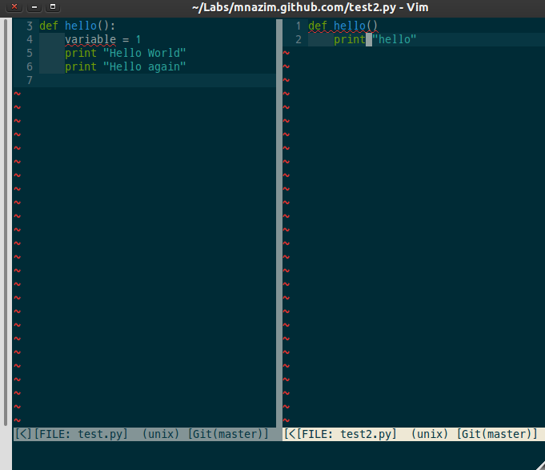

======================
Python开发生态环境简介
======================

:作者: `Mir Nazim`_
:原文: `Python Ecosystem - An Introduction`_
:译者: `dccrazyboy`_

.. _`Mir Nazim`: http://mirnazim.org/about/
.. _`Python Ecosystem - An Introduction`: http://mirnazim.org/writings/python-ecosystem-introduction/
.. _`dccrazyboy`: dccrazyboy@gmail.com

当开发人员从PHP，Ruby或者别的开发环境转换到Python时，所面对的最大问题是缺乏对Python开发的生态环境的充分理解。开发人员非常想得到一份关于完成大多数任务的指南或资源，而不论使用的方法是否规范。

下文所讲到的基本上都来源于我的\ 网站_\ ，那存储着Python环境下对于网络应用开发的一些基本资料，这些资料是为那些从别的平台转到Python开发的实习生，研究生和有经验的开发者准备的。

.. _网站 : http://ikraftsoft.com/

这不是一个完美的文档，我的目标是将它做成一个\ **永久的文档**\ ，但愿这篇文档可以发展成为一个详细的教程。

目标读者
========

这不是一本关于Python的语法书。
这个教程不会教你花哨的Python用法让你成为一名Python黑客。
我默认你已经了解Python的基础用法。如果你不知道，别往下看了。
先去看看Zed Shaw的免费教Python入门的书\ `《Learn Python The Hard Way》`_\ 。

.. _《Learn Python The Hard Way》: http://learnpythonthehardway.org/

我不知道你是不是在用Linux(最好是Ubuntu/Debian)或者是类Linux系统。
为毛？因为Linux是我最了解的系统。
除了测试跨浏览器兼容性以外，我从没在Windows或者Max OS X上面开发过。
下面是如何在不同平台安装Python的教程。

    - `Python 101: Setting up Python on Windows`_
    - `Official documentation for Python on Windows`_
    - `Official documentation for Python on Mac OS X`_

.. _`Python 101: Setting up Python on Windows`: http://www.blog.pythonlibrary.org/2011/11/24/python-101-setting-up-python-on-windows/

.. _`Official documentation for Python on Windows`: http://docs.python.org/using/windows.html

.. _`Official documentation for Python on Mac OS X`: http://docs.python.org/using/mac.html

去搜索下最适合你平台的Python安装方法。我强烈建议问Stack Overflow。

版本之惑
========

Python 2.x是一个稳定的版本，Python 3是个新的版本。如果你不在乎，跳过这段直接看下面的Python安装部分。

当开始学习Python时，安个3.x的版本看上去应该是第一步，但它可能并不一定是你想要的。

现在Python有两个正在开发的版本-2.7.x和3.x(也被称为Python3,Py3k或Python 3000)。
跟Python2相比Python3就是另外一个语言。它们之间存在者或大或小的语法差异。
现今Python2.6/2.7是被安装和应用的最为广泛的版本。
许多的主流代码和一些重要的packages/frameworks/tools/utilities/modules并不支持Python3。

因此，最安全的选择是使用2.x(2.7最好)版本。如果你完全了解Python3的话在再用它。

`Python 3 Wall of Shame`_ 列出了很多包在Python3中的兼容性。在决定用Python3之前好好看看这个。

.. _`Python 3 Wall of Shame`: http://python3wos.appspot.com/

VM挑选
======

Python解释器或Python虚拟机有很多种实现，CPython是最主流的实现。CPython同时也是别的虚拟机实现的参考解释器。

PyPy是用Python实现的Python解释器，Jython是用Java实现运行在JVM上的解释器，IronPython是用Microsoft .NET CLR实现的解释器。

除非解释器的选择非常非常重要，我们一般都用CPython。

如果上面那些关于版本和虚拟机的废话让你头疼，那你就安装CPython的2.7.x版本，相信我！

安装Python
==========

大多数的Linux/Unix系统的Max OS X都自带Python。如果没有或者版本过低，你可以通过下面的命令安装：

Ubuntu/Debian及其衍生系统::

    $ sudo apt-get install python2.7

``sudo`` 是一个是类Unix系统的一个命令，它允许用户以别的用户（一般是超级用户，或者root）的权限运行程序。 `更多请查阅Wikipedia`_ 。

.. _`更多请查阅Wikipedia`: http://en.wikipedia.org/wiki/Sudo

Fedora/Red Hat及类似系统::

    sudo yum install python2.7

使用RHEL你可能需要打开EPEL Repositories才能安装。

从这起，我将在例子中使用sudo，你需要根据你的系统进行更改。

理解包
======

你首先需要理解的是Python没有一个默认的包管理设施。事实上，包的概念在Python中是相当弱的。

可能你已经知道，Python代码被组织为模块。
一个模块可能由包含一个函数的单一文件组成，也可能由包含多个模块的目录组成。
包和模块的区别非常小，并且每个模块都能被理解为包。

那么包和模块的区别到底是什么（如果有的话）？为了明白这个，你首先应该明白Python是如何查找模块的。

如同别的编程环境一样，Python中的一些函数和类（例如str,len,Exception等）在全局（叫做内置函数）都是可用的。
别的就需要通过手动 ``import`` 进来。例如::

    >>> import os
    >>> from os.path import basename, dirname

这个包一定存在你的机子上，这样才能被import语句导入。但Python是如何知道这些模块的位置呢？
这些位置信息在你安装Python虚拟机时就被自动设置好了，并且依赖于你的目标平台。

包的路径可以在sys.path中查询。下面是在我的笔记本上的结果，运行环境是Ubuntu 11.10。 ::

    >>> import sys

    >>> print sys.path

    ['',

     '/usr/lib/python2.7',

     '/usr/lib/python2.7/plat-linux2',

     '/usr/lib/python2.7/lib-tk',

     '/usr/lib/python2.7/lib-old',

     '/usr/lib/python2.7/lib-dynload',

     '/usr/local/lib/python2.7/dist-packages',

     '/usr/lib/python2.7/dist-packages',

     '/usr/lib/python2.7/dist-packages/PIL',

     '/usr/lib/python2.7/dist-packages/gst-0.10',

     '/usr/lib/python2.7/dist-packages/gtk-2.0',

     '/usr/lib/pymodules/python2.7',

     '/usr/lib/python2.7/dist-packages/ubuntu-sso-client',

     '/usr/lib/python2.7/dist-packages/ubuntuone-client',

     '/usr/lib/python2.7/dist-packages/ubuntuone-control-panel',

     '/usr/lib/python2.7/dist-packages/ubuntuone-couch',

     '/usr/lib/python2.7/dist-packages/ubuntuone-installer',

     '/usr/lib/python2.7/dist-packages/ubuntuone-storage-protocol']

这里给出了Python搜索包的路径。它将从最上面开始找，直到找到一个名字相符的。
这表明如果两个不同的路径分别包含了两个具有相同名字的包，搜索将在找到第一个名字的时候停止，然后将永远不会往下查找。

正如你所猜的，包搜索路径很容易被劫持，为了确保Python首先载入你的包，所需做的如下： ::

    >>> sys.path.insert(0, '/path/to/my/packages')

尽管这个方法在很多情况下都很好用，但一定要小心不要滥用。 **只有当必要时再使用！不要滥用！**

``site`` 模块控制包的搜索路径。当Python虚拟机初始化时它会自动被导入。如果你想了解更多信息，请看 `官方文档`_ 。

.. _`官方文档`: http://docs.python.org/library/site.html

PYTHONPATH变量
--------------

``PYTHONPATH`` 是一个用来增加默认包搜索目录的环境变量。可以认为它是对于Python的一个特殊的 ``PATH`` 变量。
它仅仅是一个通过 ``:`` 分割，包含Python模块目录的列表（并不是类似于 ``sys.path`` 的Python list）。
它可能就类似下面这样： ::

    export PYTHONPATH=/path/to/some/directory:/path/to/another/directory:/path/to/yet/another/directory

有时候你可能并不想覆盖掉现存的 ``PYTHONPATH`` ，而仅仅是希望添加新目录到头部或尾部。 ::
    
    export PYTHONPATH=$PYTHONPATH:/path/to/some/directory    # Append
    export PYTHONPATH=/path/to/some/directory:$PYTHONPATH    # Prepend

``PYTHONPATH`` ， ``sys.path.insert`` 这些方法并非完美，我们最好也不要用这些方法。
使用它们，你可能可以解决本地的开发环境问题，但它在别的环境下也许并不适用。
有很多种方法可以达到这个效果，在下面我将一一阐述。

我们现在明白的Python如何找到安装的包路径，现在让我们回到开始那个问题。
模块和包的区别到底是什么？包是一个模块或模块/子模块的集合，一般情况下被压缩到一个压缩包中。
其中包含1)依赖信息 2)将文件拷贝到标准的包搜索路径的指令。3)编译指令(如果在安装前代码必须被编译的话)。
就这些东西！

第三方包
========

从一开始，如果要做一些实际Python开发，你一定会用到一些第三方包。

在Linux系统上至少有3种安装第三方包的方法。

1. 使用系统自带的包管理系统(deb, rpm, 等)
2. 通过社区开发的各种工具，例如 ``pip`` ， ``easy_install`` 等
3. 从源文件安装

这三个方面，几乎完成同样的事情。即：安装依赖，编译代码（如果需要的话），将一个包含模块的包复制的标准软件包搜索位置。

第二步和第三步在所有的操作系统上基本相同。
我再次希望您可以在 `Stack Overflow`_ 上找到你的平台的第三方包安装方法。

.. _`Stack OverFlow`: http://www.stackoverflow.com/

在哪找第三方包？
----------------

在安装第三方包之前，你首先要找到他们。以下是几种方法：

1. 你的系统包管理器中的发行版专用包。
2. `Python Package Index (or PyPI)`_
3. 大量的源代码服务器，例如 `Launchpad`_, `GitHub`_, `BitBucket`_ 等 

.. _`Python Package Index (or PyPI)`: http://pypi.python.org/pypi
.. _`Launchpad`: https://launchpad.net/
.. _`GitHub`: http://github.com/
.. _`BitBucket`: https://bitbucket.org/

通过发行版专用包安装
--------------------

通过包管理器安装包安装包就像使用命令行或者GUI安装别的软件那样简单。
例如在Ubuntu中安装 ``simplejson`` ::
    
    $ sudo apt-get install python-simplejson

通过pip安装
-----------

easy_install渐渐不再流行。我们将主要介绍pip，它是easy_install的一个替代品。

pip是一个用来安装和管理Python包的工具，就如同Python Packet Index一样。
pip并没有随着Python一起安装，因此我们需要先安装它。Linux下，一般这样安装： 

::

    $ sudo apt-get install python-pip

在安装任何其他包之前，我总是通过PyPI将pip升级到最新版本的,
Ubuntu软件库中的版本普遍落后的PyPI。我通过pip升级pip它自己。

::

    $ sudo pip install pip --upgrade

现在如果需要安装任何包，你可以运行 ``pip install package-name`` 命令。
所以可以通过下面命令安装 ``simplejson``: ::

    $ sudo pip install simplejson

删除包也很简单。 ::

    $ sudo pip uninstall simplejson

一般情况下， ``pip`` 会从PyPI自动安装最新的稳定版，
但有时我们需要安装一个特定版本的包，因为你的项目可能基于特殊的版本。
因此你可能需要使用类似如下的 ``pip install`` 命令： 

::

    $ sudo pip install simplejson==2.2.1

我们可能需要升级/降级/重新安装包。此时可以通过下面的命令完成：

::

    $ sudo pip install simplejson --upgrade         # Upgrade a package to the latest version from PyPI
    $ sudo pip install simplejson==2.2.1 --upgrade  # Upgrade/downgrade a package to a given version

现在，如果你想安装一个处于开发版本的包，它在版本控制仓库有，但是PyPI中还没有怎么办？
``pip`` 能够很好的处理这种情况，但在这之前，你需要自己安装这个版本控制仓库。Ubuntu下，你可以如下安装：

::

    $ sudo apt-get install git-core mercurial subversion

安装版本控制仓库之后，从版本控制仓库安装包就如下所示：

::

    $ sudo pip install git+http://hostname_or_ip/path/to/git-repo#egg=packagename
    $ sudo pip install hg+http://hostname_or_ip/path/to/hg-repo#egg=packagename
    $ sudo pip install svn+http://hostname_or_ip/path/to/svn-repo#egg=packagename

你也可以同样简单的从本地仓库安装，注意下面的三斜杠是文件目录。

::

    $ sudo pip install git+file:///path/to/local/repository

有一点需要注意，如果使用 ``git`` 协议安装，你需要使用 ``git+git`` 前缀：

::

    $ sudo pip install git+git://hostname_or_ip/path/to/git-repo#egg=packagename

现在你可能会好奇这些 *egg* 会被怎么使用。
现在你需要明白的是一个egg是一个被压缩的Python包，里面包含了源代码和一些元数据。
``pip`` 在安装包前建立了egg信息。你可以在代码仓库的 ``setup.py`` 文件中找到egg名字。
找到 ``setup`` 块然后找到类似于 ``name="something"`` 的字段。
它可能看起来就像如下的代码（这段代码从simplejson的 ``srtup.py`` 得到）一样。

::

    setup(

    name="simplejson", # <--- This is your egg name

    version=VERSION,

    description=DESCRIPTION,

    long_description=LONG_DESCRIPTION,

    classifiers=CLASSIFIERS,

    author="Bob Ippolito",

    author_email="bob@redivi.com",

    url="http://github.com/simplejson/simplejson",
    
    license="MIT License",

    packages=['simplejson', 'simplejson.tests'],

    platforms=['any'],

    **kw)

如果没有 ``setup.py`` 文件咋办？这样如何找到egg名？其实我们不需要。
把包源码拷贝到你的工程目录下，然后导入进去就可以直接用了。

--user 选项
-----------

上面的所有例子把包都安装到系统范围。如果你在 ``pip install`` 时使用 ``--user`` 选项，包将被安装到 ``~/.local`` 目录下。在我的机子上，如下所示：

::

    $ pip install --user markdown2

    Downloading/unpacking markdown2

      Downloading markdown2-1.0.1.19.zip (130Kb): 130Kb downloaded

      Running setup.py egg_info for package markdown2

    Installing collected packages: markdown2

      Running setup.py install for markdown2

        warning: build_py: byte-compiling is disabled, skipping.

        changing mode of build/scripts-2.7/markdown2 from 664 to 775

        warning: install_lib: byte-compiling is disabled, skipping.

        changing mode of /home/mir/.local/bin/markdown2 to 775

    Successfully installed markdown2

    Cleaning up...

注意： *markdown2* 被安装到 ``/home/mir/.local/bin/markdown2`` 这个目录下。

有很多原因使你不想将包安装到系统目录中。
稍后我将讲解如何对于每个项目设置独立的Python环境。

从源码安装
----------

从源码安装包仅仅需要一个命令，解压这个包到一个目录，然后执行下面的命令。

::

    cd /path/to/package/directory

    python setup.py install

尽管这些安装的办法并没有什么不同，但 ``pip`` 方式是最好的。
``pip`` 让你拥有轻松升级/降级包的能力，而手动安装你就不得不去手动下载，解压的安装。
手动安装包应该使你最后一个选择，如果别的全部失败了（一般不太可能）。

安装需要编译的包
----------------

我们现在已经了解了大多数包的安装方法，但有些包还没有介绍：包含C/C++代码的Python包，它们需要在安装前被编译。
关于这些包最好的例子是数据库适配器，图片处理库等。

虽然 ``pip`` 可以处理编译安装的源码，但我个人更喜欢使用发行版的包管理器提供的包。
它将会安装编译好的二进制文件。

如果你还是想用 ``pip`` 安装，下面是在Ubuntu系统上需要做的。

编译器的相关工具：

::

    $ sudo apt-get install build-essential

Python开发环境（头文件等）：

::

    $ sudo aptitude install python-dev-all

如果你的系统没有 ``python-dev-all`` ，看看这些相似的名字 ``python-dev`` , ``python2.X-dev`` 等等。

确保你已经安装了 ``psycopg2`` （PostgreSQL RDBMS adapter for Python），你将需要PostgreSQL的开发文件。

::

    $ sudo aptitude install  postgresql-server-dev-all

完成这些依赖的安装后，你就能运行 ``pip install`` 了。

::

    $ sudo pip install psycopg2

还需要注意一点： **并不是所有的包都能通过pip编译安装！** 。
但如果你对编译安装很有自信，或者已经对于如何在自己的目标平台安装有足够的经验。
那就大胆的手动安装吧！

Python开发环境
==============

不同的人喜欢用不同的方式建立各自的开发环境，但在几乎所有的编程社区，总有一个（或一个以上）开发环境让人更容易接受。
使用不同的开发环境虽然没有什么错误，但有些环境设置更容易进行便利的测试，并做一些重复/模板化的任务，使得在每天的日常工作简单并易于维护。

virtualenv
----------

在Python的开发环境的最常用的方法是使用virtualenv包。
Virtualenv是一个用来创建独立的Python环境的包。现在，出现了这样的问题：为什么我们需要一个独立的Python环境？
要回答这个问题，请允许我引用virtualenv自己的文档：

    我们需要处理的基本问题是包的依赖、版本和间接权限问题。想象一下，你有两个应用，一个应用需要libfoo的版本1，而另一应用需要版本2。如何才能同时使用这些应用程序？如果您安装到的/usr/lib/python2.7/site-packages（或任何平台的标准位置）的一切，在这种情况下，您可能会不小心升级不应该升级的应用程序。

简单地说，你可以为每个项目建立不同的/独立的Python环境，你将为每个项目安装所有需要的软件包到它们各自独立的环境中。

使用 ``pip`` 命令来安装virtualenv： 

::

    $ sudo pip install virtualenv

virtualenv安装完毕后，可以通过运行下面的命令来为你的项目创建独立的python环境。

::

    $ mkdir my_project_venv

    $ virtualenv --distribute my_project_venv

    # The output will something like:

    New python executable in my_project_venv/bin/python

    Installing distribute.............................................done.

    Installing pip.....................done.

上面发生了什么？你创建了文件夹 ``my_project_venv`` 来存储你的新的独立Python环境。
``--distribute`` 选项使virtualenv使用新的基于发行版的包管理系统而不是 ``setuptools`` 获得的包。
你现在需要知道的就是 ``--distribute`` 选项会自动在新的虚拟环境中安装 ``pip`` ，这样就不需要手动安装了。
当你成为一个更有经验的Python开发者，你就会明白其中细节。

现在看看 ``my_project_venv`` 目录，你会看到这样的结构：

::

    # 这里只列出了将被讨论的目录和文件

    .

    |-- bin

    |   |-- activate  # <-- 这个virtualenv的激活文件 

    |   |-- pip       # <-- 这个virtualenv的独立pip

    |   `-- python    # <-- python解释器的一个副本

    `-- lib

        `-- python2.7 # <-- 所有的新包会被存在这

通过下面的命令激活这个virtualenv：

::

    $ cd my_project_venv

    $ source bin/activate

执行完毕后，提示可能是这个样子的：

::

    (my_project_venv)$ # the virtualenv name prepended to the prompt

通过 deactivate 命令离开virtualenv环境

::

    (my_project_venv)$ deactivate

运行下面的命令可以更好地理解两者的差异，如果已经进入virtualenv请先离开。

首先让我们看看如果调用python/pip命令它会调用那一个。

::

    $ which python

    /usr/bin/python

    $ which pip

    /usr/local/bin/pip

再来一次！这次打开virtualenv，然后看看有什么不同。我的机子上显示如下：

::

    $ cd my_project_venv

    $ source bin/activate

    (my_project_venv)$ which python

    /home/mir/my_project_venv/bin/python

    (my_project_venv)$ which pip

    /home/mir/my_project_venv/bin/pip

virtualenv拷贝了Python可执行文件的副本，并创建一些有用的脚本和安装了项目需要的软件包，你可以在项目的整个生命周期中安装/升级/删除这些包。
它也修改了一些搜索路径，例如PYTHONPATH，以确保：
    
    1) 当安装包时，它们被安装在当前活动的virtualenv里，而不是系统范围内的Python路径
    2) 当import代码时，virtualenv将优先采取本环境中安装的包，而不是系统Python目录中安装的包。

还有一点比较重要，在默认情况下，所有安装在系统范围内的包对于virtualenv是可见的。
这意味着如果你将simplejson安装在您的系统Python目录中，它会自动提供给所有的virtualenvs使用。
这种行为可以被更改，在创建virtualenv时增加 ``--no-site-packages`` 选项的virtualenv就不会读取系统包，如下：

::

    $ virtualenv my_project_venv --no-site-packages

virtualenvwrapper
-----------------

``virtualenvwrapper`` 是一个建立在 ``virtualenv`` 上的工具，通过它可以方便的创建/激活/管理/销毁虚拟环境，没它的话进行上面的操作将会相当麻烦。
可以通过下面命令安装 ``virtualenvwrapper`` 。

::

    $ sudo pip install virtualenvwrapper

安装后，你需要配置它。下面是我的配置：

::

    if [ `id -u` != '0' ]; then

      export VIRTUALENV_USE_DISTRIBUTE=1        # <-- Always use pip/distribute

      export WORKON_HOME=$HOME/.virtualenvs       # <-- Where all virtualenvs will be stored

      source /usr/local/bin/virtualenvwrapper.sh

      export PIP_VIRTUALENV_BASE=$WORKON_HOME

      export PIP_RESPECT_VIRTUALENV=true

    fi

设置 ``WORKON_HOME`` 和 ``source /usr/local/bin/virtualenvwrapper.sh`` 只需要几行代码，别的部分是按照我个人喜好添加的。

将上面的配置添加到 ``~/.bashrc`` 的末尾，然后将下面的命令运行一次：

::

    $ source ~/.bashrc

如果你关闭所有的shell窗口和标签，然后再打开一个新的shell窗口或标签时， ``~/.bashrc`` 也会被执行，此时将会自动的更新你的 ``virtualenvwrapper`` 配置。
效果就跟执行上面的命令一样。

新建/激活/关闭/删除虚拟空间需要执行下面的命令：

::

    $ mkvirtualenv my_project_venv

    $ workon my_project_venv

    $ deactivate

    $ rmvirtualenv my_project_venv

*Tab补全在virtualenvwrapper中是可用的哦～*

前往 `virtualenvwrapper 主页`_ 查找更多关于它的信息。

.. _`virtualenvwrapper 主页`: http://www.doughellmann.com/projects/virtualenvwrapper/

通过pip和virtualenv进行依赖管理
-------------------------------

``pip`` 结合 ``virtualenv`` 可以为你的项目提供基本的依赖管理。

你可以通过 ``pip freeze`` 命令来查看当前已安装的包版本。下面列出的是我写着个博客所用到的包的版本：

::

    $ pip freeze -l 

    Jinja2==2.6

    PyYAML==3.10

    Pygments==1.4

    distribute==0.6.19

    markdown2==1.0.1.19

注意 ``-l`` 选项，它告诉 ``pip`` 只导出当前活动虚拟空间中安装的包，排除那些全局空间安装的包。

你可以把结果保存到文件里，然后将它添加到你的版本控制系统里。

::

    $ pip freeze -l  > requirements.txt

同时 ``pip`` 也能从一个包含 ``pip freeze`` 命令的文件中安装包。

::

    $ pip install -r requirements.txt

其他重要工具
============

虽然我们讨论了基本的Python版本，虚拟机和包管理，但在日常工作中我们仍然还需要一些专用的工具来完成任务。
尽管我不能把每一个工具的细节都讲到，然而我还是尽量给你提供基本的概述。

编辑器
------

对于Python编程有大量很优秀的编译器。对于我个人而言，我更倾向于Vim，但这里我并不想挑起一场 *编辑器战争* 。

有大量支持Python的编辑器，例如：Vim/Gvim, Emacs, GNOME上的GEdit,
KDE上的Kate, Scribes, ActiveState的Komodo Edit/IDE, WingWare的Wing IDE,
JetBrains上PyCharm, Eclipse的PyDEV插件。此外，还有其他，但这些似乎是最流行的。你可以任意选择最适合你的。

Pyflakes：源码检测工具
----------------------

Pyflakes是一个检查Python源码并通过文本分析找出错误的工具。
它可以检测出语法错误，和（部分）逻辑错误，导入但未使用的模块，只使用一次的变量，等等。

你可以通过 ``pip`` 安装：

::

    $ pip install pyflakes

在命令行调用它，参数填源文件名即可，如下所示：

::

    $ pyflakes filename.py

Pyflakes也可已被集成进编辑器。这是它在我的vim中的样子。注意红波浪线：

请自行前往Stack Overflow找出如何将Pyflakes添加到编辑器。

`Pyflakes官网`_

.. _`Pyflakes官网`: https://launchpad.net/pyflakes

Requests:一个HTTP库
-------------------

Requests是一个将处理HTTP请求变得轻而易举的库。

同样是通过 ``pip`` 安装它：

::

    $ pip install requests

下面是一个例子：

::

    >>> import requests

    >>> r = requests.get('https://api.github.com', auth=('user', 'pass'))

    >>> r.status_code

    204

    >>> r.headers['content-type']

    'application/json'

    >>> r.content

    ...

`Requests文档`_ 

.. _`Requests文档`: http://docs.python-requests.org/en/latest/index.html

Flask:一个web开发的微框架
--------------------------

Flask是一个基于Werkzeug和Jinja2的微框架。

通过 ``pip`` 安装：

::

    $ pip install Flask

这是一个简单的例子：

::

    from flask import Flask

    app = Flask(__name__)

    @app.route("/")

    def hello():

        return "Hello World!"

    if __name__ == "__main__":

        app.run()

可以这样运行它：

::

    $ python hello.py

     * Running on http://localhost:5000/

`Flask官网`_

.. _`Flask官网`: http://flask.pocoo.org/

Django:一个全栈式web开发框架
----------------------------

Django是一个全栈式web开发框架。它提供了ORM，HTTP库，表单处理，XSS过滤，模板和别的特性。

通过 ``pip`` 安装：

::

    $ pip install Django

去 `Django官网`_ 查找更多信息。

.. _`Django官网`: http://djangoproject.com/

Fabric:简化SSH的使用并部署系统管理员任务
----------------------------------------

Fabric是一个命令行工具用来简化程序对于SSH的使用或运行系统管理员任务。
它提供了一个基本套件可以执行本地或远程shell命令（正常或通过sudo），上传/下载文件，以及其他辅助功能，如提示用户输入，或中止执行的操作。

可以通过 ``pip`` 安装：

::

    $ pip install fabric

这是一个通过Fabric写的任务：

::

    from fabric.api import run

    def host_type():

        run('uname -s')

你可以在一台或多台服务器上执行这个命令：

::

    $ fab -H localhost host_type

    [localhost] run: uname -s

    [localhost] out: Linux

    Done.

    Disconnecting from localhost... done.

`Fabric官网`_

.. _`Fabric官网`: http://fabfile.org/

SciPy:一个科学计算库
--------------------

如果你的工作涉及科学和数值计算，SciPy的是您不可或缺的重要工具。

SciPy官网这样介绍：
    
    SciPy的（读做“Sigh Pie”）是数学、科学和工程方面的开源库。
    这也是Python在数值计算方面非常优秀的一个库。 
    SciPy的库依赖于NumPy，它提供了方便快速的N维矩阵操作。 
    SciPy库与NumPy中的矩阵兼容，并提供了许多用户友好且高效率的数值程序，如数值的积分和优化。
    同时，他们运行在所有流行的操作系统上，安装快速，并且都是免费的。NumPy和SciPy易于使用，但功能强大，足以满足一些世界领先的科学家和工程师。
    如果您需要在电脑上处理数字、显示或公布结果，试试SciPy吧！

`SciPy`_

.. _`SciPy`: http://www.scipy.org/

PEP 8:Python风格指南
--------------------

虽然它本身不是一个软件工具，但它却是Python一个重要的资源。

PEP 8是一个描述Python发行版中基本库的编码约定的文档。
这份文档的希望能够约定全世界Python开发者的代码布局，变量、类、函数的命名规则。
请确保你了解它，并遵循它。他将在未来的Python使用中带来相当多的益处。

`PEP 0008`_

.. _`PEP 0008`: http://www.python.org/dev/peps/pep-0008/

强大的Python标准库
------------------

Python的标准库涵盖非常广泛，提供各种各样的功能。
该库包含的内置模块（使用C编写的）提供了访问系统的功能，如文件I/O，
并且存在大量Python编写的模块，他们提供标准化的解决方案去解决日常的编程中出现的许多问题。
这些模块都明确地抽离平台的细节，提供平台无关的API，旨在加强Python程序的跨平台可移植性。

推荐阅读
========

David Goodger的 `Code Like a Pythonista: Idiomatic Python`_ 包含了很多实用的Python例子和技术。

.. _`Code Like a Pythonista: Idiomatic Python` : http://python.net/~goodger/projects/pycon/2007/idiomatic/handout.html

Doug Hellmann的 `Python Module of the Week` 系列的重点是建设一个使用Python标准库中的模块的示例代码的仓库。

赠言
====

这个教程到目前为止，所讲述的仅是点到为止。Python世界中有大量的工具，库和软件可以帮你完成你的工作。
但你需要自己花时间去发现他们！

Python有一个伟大的社区和一群很聪明的维护者，他们对于新手非常有耐心。
因此，关注你最喜欢的开源项目，加入他们的邮件列表，跟有经验的开发者交流经验。
不久的将来，你的经验也将足够丰富，你将会成为他们其中的一员。

最后我想引用下 **Zen Of Python** 。我们思考，学习，受到启发！
*Happy Pythoning*

::

    >>> import this

    The Zen of Python, by Tim Peters

    Beautiful is better than ugly.

    Explicit is better than implicit.

    Simple is better than complex.

    Complex is better than complicated.

    Flat is better than nested.

    Sparse is better than dense.

    Readability counts.

    Special cases aren't special enough to break the rules.

    Although practicality beats purity.

    Errors should never pass silently.

    Unless explicitly silenced.

    In the face of ambiguity, refuse the temptation to guess.

    There should be one-- and preferably only one --obvious way to do it.

    Although that way may not be obvious at first unless you're Dutch.

    Now is better than never.

    Although never is often better than *right* now.

    If the implementation is hard to explain, it's a bad idea.

    If the implementation is easy to explain, it may be a good idea.

    Namespaces are one honking great idea -- let's do more of those!
